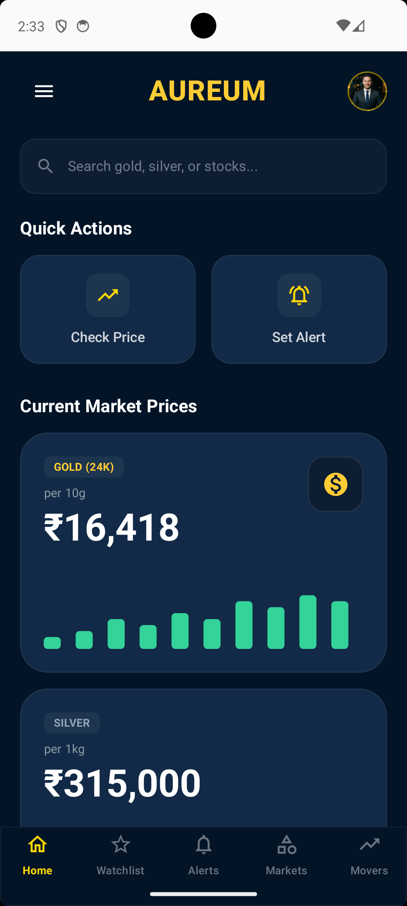
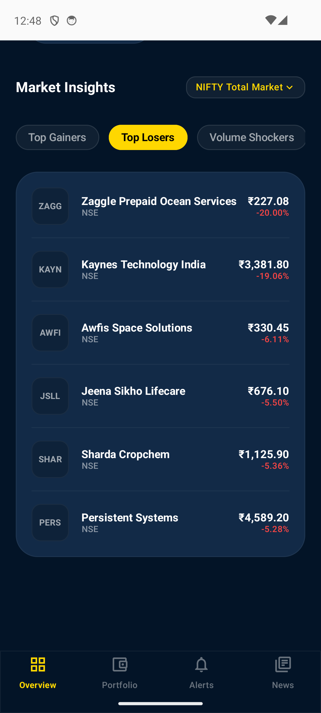
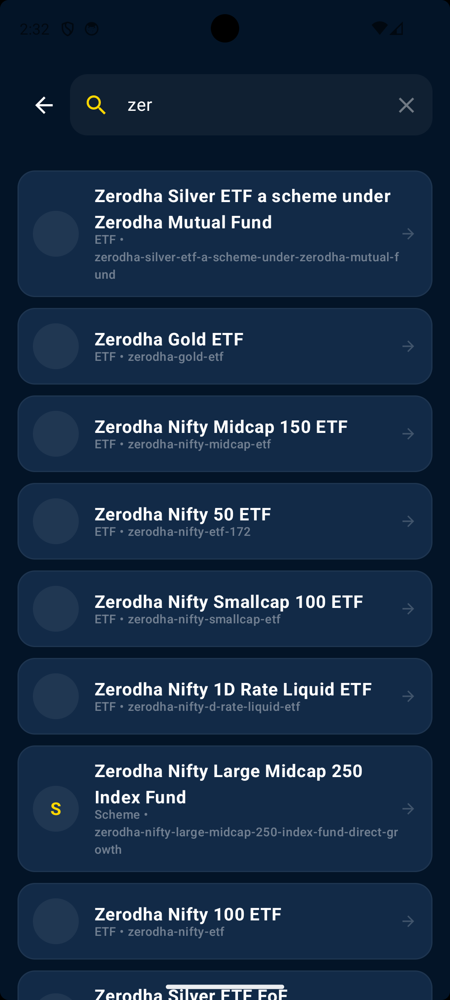
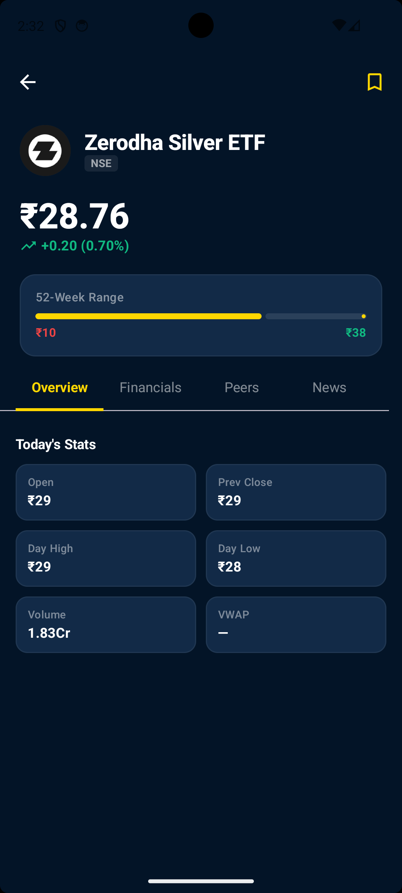

# Sonar 🪙 — Live Gold Rate & Nifty 50 Radar for India

[](https://developer.android.com)
[](https://kotlinlang.org)
[](https://developer.android.com/jetpack/compose)
[](https://opensource.org/licenses/MIT)
[](https://makeapullrequest.com)
[](https://github.com/aureum-app/RateWatch/stargazers)
[](https://github.com/aureum-app/RateWatch/network/members)

<!-- SEO Description -->
<meta name="description" content="Sonar is a free, open-source Android app for live gold rate today, silver price, Nifty 50 live & Sensex in India. Real-time 22K gold rates across 50+ Indian cities + Indian stock market indices with premium UI in 10 languages.">
<meta name="keywords" content="gold rate today, live gold rate, 22k gold rate, nifty 50 live, silver rate today, gold price india, nifty live, sensex live, gold rate delhi mumbai, bank nifty, sonar gold nifty, indian stock market app">
<meta name="author" content="Sonar">
<meta name="robots" content="index, follow">

<!-- Open Graph -->
<meta property="og:title" content="Sonar - Live Gold Rate, Silver Price & Nifty 50 for India">
<meta property="og:description" content="Free Android app: Real-time 22K/24K gold rate today, silver rates across Indian cities, Nifty 50 live, Sensex & Bank Nifty. 10+ Indian languages. Made for Bharat.">
<meta property="og:type" content="software">
<meta property="og:url" content="https://github.com/aureum-app/RateWatch">

**Sonar** (सोनार) is a high-performance, open-source fintech radar built for the Indian market. Track live **22K & 24K gold rate today**, **silver price**, **Nifty 50 live**, **Sensex**, and Bank Nifty across 50+ Indian cities — all in your preferred language (Hindi, Tamil, Telugu and 8 more).

---

## 📖 Table of Contents
- [Overview](#-overview)
- [Key Features](#-key-features)
- [Screenshots](#-screenshots)
- [Architecture & Tech Stack](#-architecture--tech-stack)
- [Getting Started](#-getting-started)
- [API Configuration](#-api-configuration)
- [Release Builds](#-release-builds)
- [Branding & Metadata](#-branding--metadata)
- [License](#-license)

---

## 🌟 Overview
**Sonar** is your daily radar for wealth in India. Built for investors, jewelers, and families, it combines live precious metal rates (gold & silver) with major Indian equity indices (Nifty 50, Sensex, Bank Nifty) in one fast, beautiful app.

Whether you're checking **gold rate in Delhi today** for a wedding (shadi), tracking **Nifty 50 live** for your portfolio, or monitoring silver prices for business — Sonar gives you accurate, real-time data in 10+ Indian languages with minimal data usage.

---

## 🔍 Frequently Asked Questions (FAQ)

### Does Sonar show gold rate for my city?
Yes! Sonar tracks accurate **22K and 24K gold rate today** and silver rates for **50+ major Indian cities** — Delhi, Mumbai, Bangalore, Hyderabad, Chennai, Kolkata, Pune, Ahmedabad, Jaipur, Lucknow and more. Updated in real-time.

### Can I track Nifty 50, Bank Nifty and Sensex?
Yes. Sonar shows **Nifty 50 live**, BSE Sensex, Bank Nifty and key sectoral indices with clean charts.

### Is Sonar free?
100% free, open-source (MIT), no ads, no tracking, no paywall. Built for Bharat.

### Does it work on slow networks?
Yes. Sonar is offline-first with smart caching. Works beautifully even on 4G or patchy connections.

### Which languages are supported?
Full support for **10+ Indian languages**: Hindi, Tamil, Telugu, Bengali, Marathi, Gujarati, Kannada, Malayalam, Punjabi, and English. Switch anytime.

---

## ✨ Key Features
- **Live Gold & Silver Rates** — Real-time **22K/24K gold rate today** and silver price per kg across 50+ Indian cities.
- **Nifty 50 & Sensex Live** — Clean tracking of Nifty 50, Bank Nifty, Sensex and major Indian indices.
- **Sonar Design** — Premium glass-morphic dark UI (#031427 navy) with buttery animations — built for daily use by Indian traders & families.
- **10+ Indian Languages** — Native experience in Hindi, Tamil, Telugu, Bengali, Marathi, Gujarati, Kannada, Malayalam, Punjabi & English.
- **Price Alerts & Watchlist** — Get notified when gold or Nifty hits your target price.
- **Lightweight & Private** — Minimal data usage, offline caching, zero trackers or ads. Pure focus on rates.

---

## 📱 Screenshots
<p align="center">




  <br>
  <em>Premium Glass-morphic UI across all core features</em>
</p>

---

## 🛠 Architecture & Tech Stack
Aureum follows modern Android development best practices and Clean Architecture:

- **Language**: [Kotlin](https://kotlinlang.org)
- **UI Framework**: [Jetpack Compose](https://developer.android.com/jetpack/compose) with Material 3
- **Dependency Injection**: [Hilt](https://developer.android.com/training/dependency-injection/hilt-android)
- **Networking**: [Retrofit](https://square.github.io/retrofit/) & [OkHttp](https://square.github.io/okhttp/)
- **Reactive Programming**: [Kotlin Coroutines](https://kotlinlang.org/docs/coroutines-overview.html) & [Flow](https://kotlinlang.org/docs/flow.html)
- **Data Management**: [DataStore](https://developer.android.com/topic/libraries/architecture/datastore) (Preferences)
- **Image Loading**: [Coil](https://coil-kt.github.io/coil/)

---

## 🚀 Getting Started

### Prerequisites
- **Android Studio** Hedgehog (2023.1.1) or higher.
- **JDK 17** or higher.
- **Android SDK 35** (compileSdk).
- **Minimum SDK 24** (Android 7.0).

### Installation
1. Clone the repository:
   ```bash
   git clone https://github.com/yourusername/RateWatch.git
   ```
2. Open the project in Android Studio.
3. Sync Gradle and build the project.

---

## 📡 API Configuration
To protect sensitive endpoints and facilitate open-source contributions, Aureum uses a `local.properties` configuration system.

1. Locate `local.properties` in your root directory (automatically created by Android Studio).
2. Add your custom API base URLs:
   ```properties
   GOLD_SILVER_BASE_URL=https://your-api.com/
   STOCK_API_BASE_URL=https://your-api.com/
   ```
*Note: The app expects these endpoints to follow the [Scraper API Schema](docs/api-schema.md).*

---

## 📦 Release Builds
To generate production-ready artifacts:

### 1. Android App Bundle (.aab)
```bash
./gradlew bundleRelease
```
Path: `app/build/outputs/bundle/release/app-release.aab`

### 2. APK (.apk)
```bash
./gradlew assembleRelease
```
Path: `app/build/outputs/apk/release/app-release.apk`

---

## 🔑 Signing Configuration
The project uses `key.properties` for release signing. **Do NOT commit `key.properties` or `*.jks` files to version control.**

Example `key.properties`:
```properties
storePassword=your_password
keyPassword=your_password
keyAlias=ratewatch
storeFile=ratewatch-release.jks
```

---

## 🎨 Branding & Metadata
- **Brand**: Sonar (सोनार) — Live Gold, Silver & Nifty Radar for India
- **Play Store Listing**: Fully ASO-optimized metadata in [listing.md](./playstore_listing/listing.md) targeting Indian keywords (gold rate today, nifty 50 live, etc.)
- **Assets**: App icon, feature graphic and screenshots in `playstore_listing/`
- **Recommended Title**: `Sonar - Gold Rate & Nifty 50` (29 chars)

---

## 📝 License
This project is licensed under the **MIT License**.

```text
MIT License

Copyright (c) 2026 Sonar (KwikTwik)

Permission is hereby granted, free of charge, to any person obtaining a copy
of this software and associated documentation files (the "Software"), to deal
in the Software without restriction, including without limitation the rights
to use, copy, modify, merge, publish, distribute, sublicense, and/or sell
copies of the Software, and to permit persons to whom the Software is
furnished to do so, subject to the following conditions:

The above copyright notice and this permission notice shall be included in all
copies or substantial portions of the Software.
```

---

Made with ❤️ for Bharat. Sonar — your daily radar for gold rate, silver price & Nifty 50.
