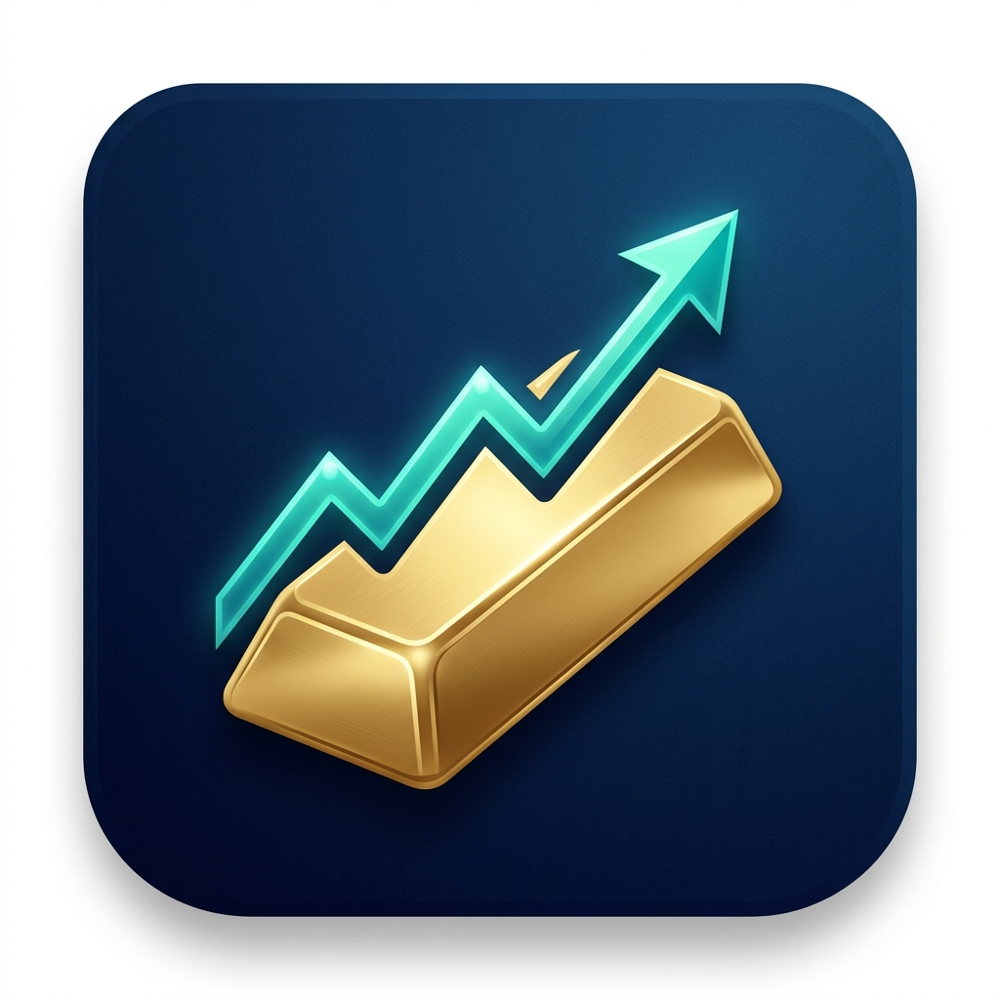
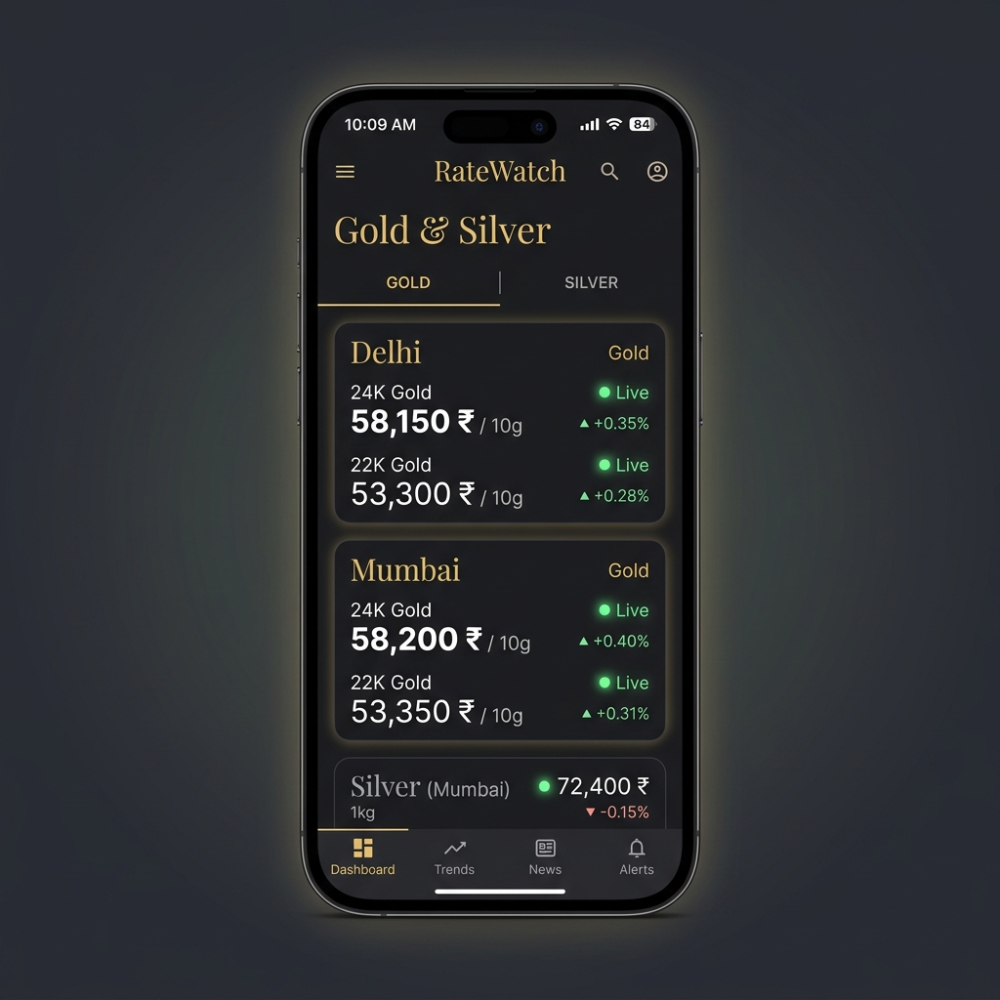
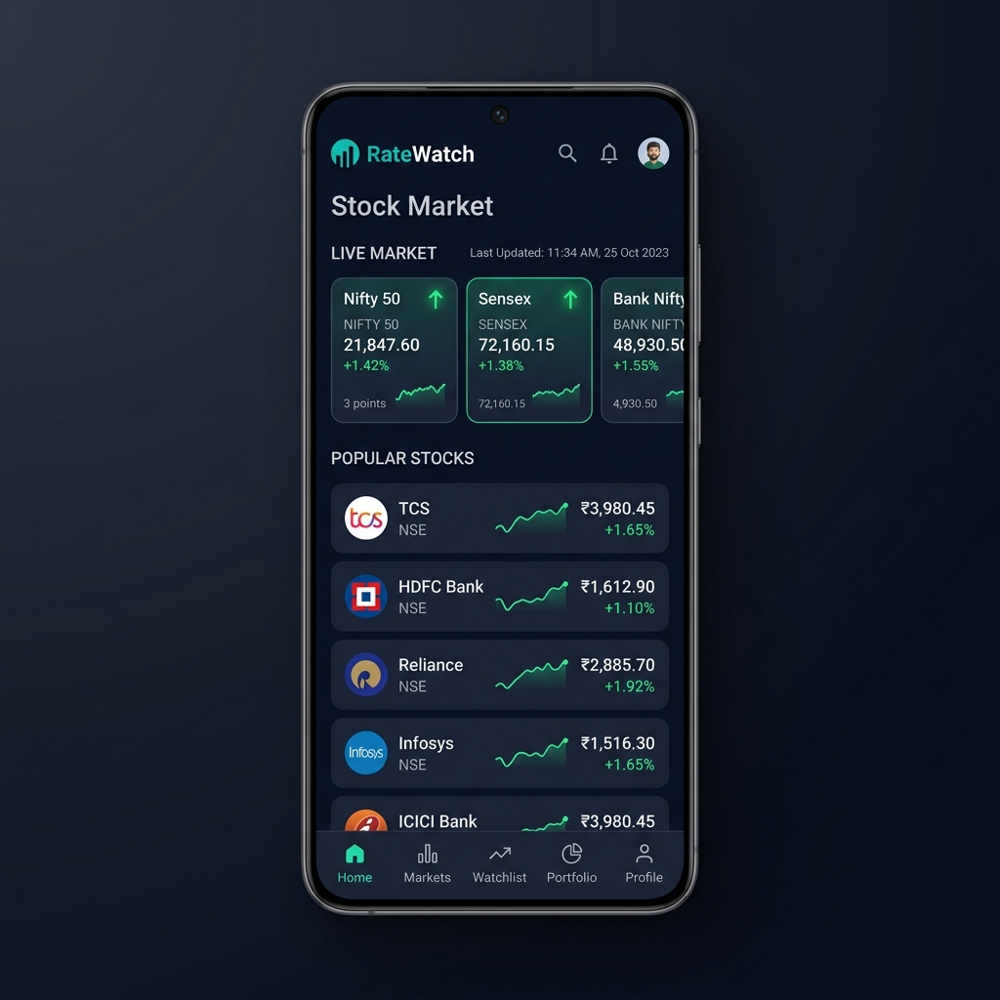
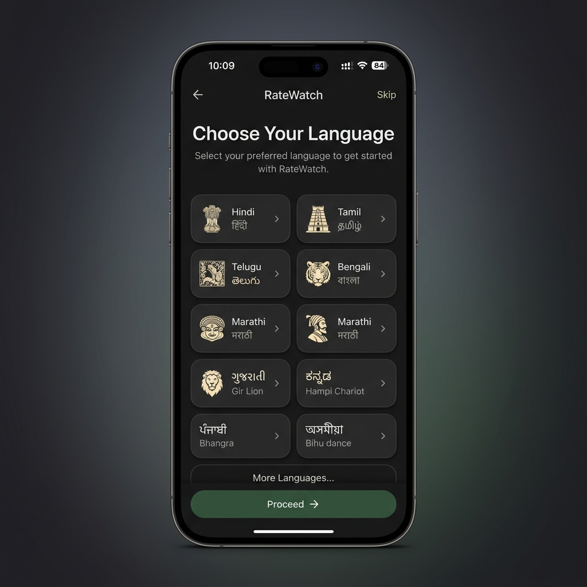
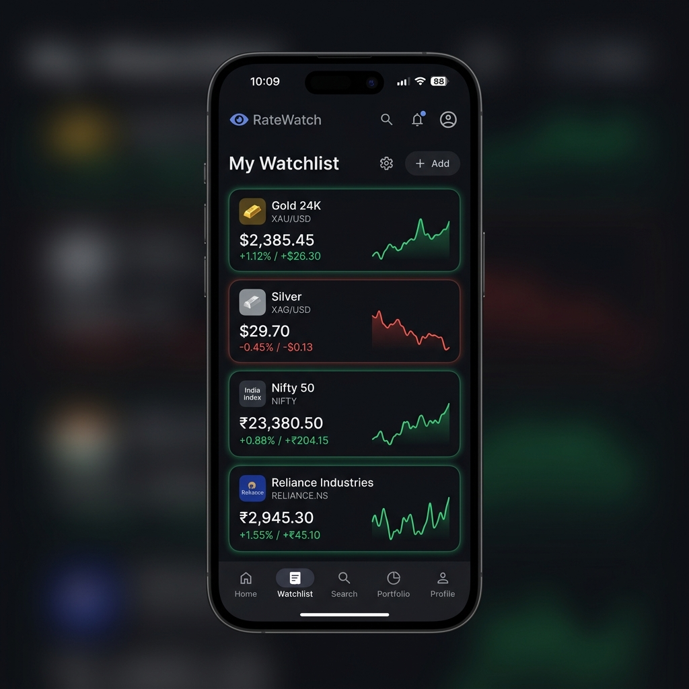

# 📱 Play Store Listing: RateWatch (ASO Optimized)

## 🖼️ Media Assets
*   **App Icon:**  (512x512)
*   **Feature Graphic:**  (1024x500)
*   **Phone Screenshots:**
    *    (Gold & Silver Rates)
    *    (Stock Market Indices)
    *    (Multi-language Support)
    *    (Custom Watchlist)

## ⚖️ Compulsory Information
*   **Privacy Policy:** [Insert Your Privacy Policy URL Here]
*   **Target Audience:** 13+ (Financial Information)
*   **Category:** Finance

## 🏷️ Title (Max 30 chars)
**Live Gold Rate & Stock Market**
*(Alternative: RateWatch: Gold & Stock Market)*

## 📝 Short Description (Max 80 chars)
Live gold price in India, silver rates & stock market (Nifty, Sensex) in Hindi.

## 📖 Full Description (ASO Optimized)

**Stay ahead of the market with RateWatch — Your ultimate app for Live Gold Rate, Silver Price Today, and Indian Stock Market updates!**

Whether you are an investor, a jeweler, or someone planning to buy gold, **RateWatch** is the perfect premium app for monitoring live precious metal rates and stock market performance in India. Enjoy real-time, accurate data with a beautiful Material 3 interface, perfectly localized in your native language.

### ✨ Key Features:

📈 **Live Gold Rate & Silver Price Today**
*   Track **22K and 24K Gold Price in India** (per 1g, 8g, 10g, 100g) in real-time.
*   Monitor live silver rates (per kg) instantly.
*   City-wise rates for 50+ major Indian cities including Delhi, Mumbai, Chennai, Bangalore, Hyderabad, Kolkata, Pune, and more.

📊 **Indian Stock Market & Indices**
*   Get live updates on the **Indian Stock Market**.
*   Track major indices: **Nifty 50 Live**, **Sensex**, and **Bank Nifty**.
*   Stay updated with popular stocks and identify market trends to make informed investment decisions.

⭐ **Custom Watchlist**
*   Save your favorite metals and stocks to a personalized watchlist for quick, one-tap access to the live rates that matter most to you.

🇮🇳 **Available in 10+ Indian Languages**
*   We speak your language! RateWatch offers full support for 10 Indic languages: **Hindi, Tamil, Telugu, Bengali, Marathi, Gujarati, Kannada, Malayalam, Punjabi**, and English. Switch languages seamlessly on the go.

🎨 **Premium Material Design & Dark Mode**
*   Experience a stunning, fluid UI built with modern Material 3 components.
*   Dynamic theming and a sleek Dark Mode ensure comfortable viewing day and night.

⚡ **Lightweight, Fast, and Accurate**
*   Optimized for maximum performance with minimal data consumption, ensuring you never miss a market movement.

Empowering Indian investors, traders, and shoppers with transparent, real-time pricing information.

**Download RateWatch now to get the most accurate Live Gold Rate, Silver Price Today, and Indian Stock Market updates!**
